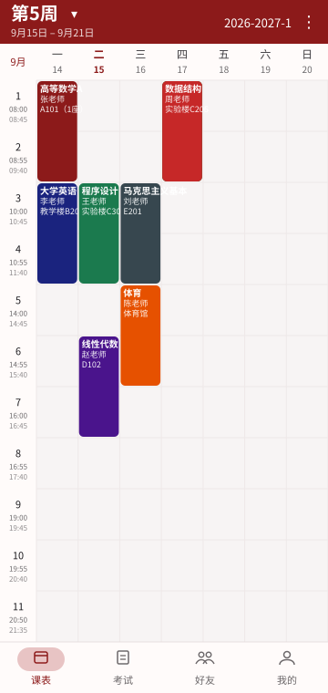
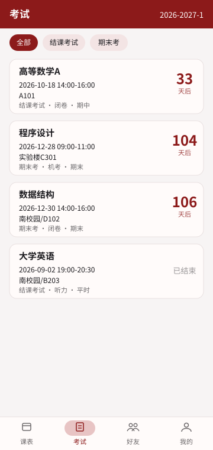
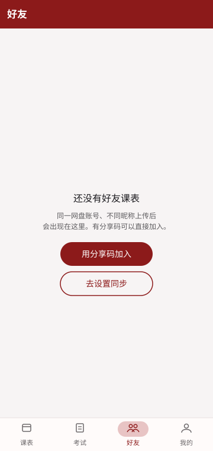
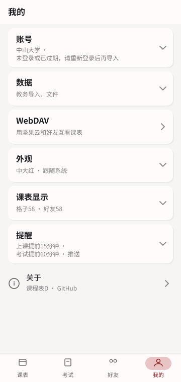
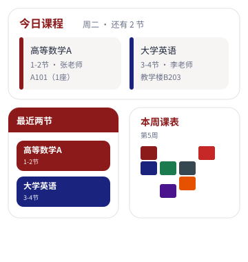

<p align="center">
  <strong>课程表D</strong><br />
  中山大学 · 广州大学 · 北京师范大学珠海校区
</p>

<p align="center">
  <a href="https://github.com/pipidu/sysukcb/releases/latest"></a>
  <a href="https://github.com/pipidu/sysukcb/releases/latest"></a>
</p>

在应用里登录教务，把课表和考试留在手机上：离线查看、手动改课、和同学同步，桌面小组件和上课提醒都有。

数据只存在本机。WebDAV 走你自己的网盘，不经过本应用的服务器。

<p align="center">
  <a href="https://github.com/pipidu/sysukcb/releases/latest"><strong>下载 APK</strong></a>
  ·
  <a href="https://github.com/pipidu/sysukcb">源码</a>
</p>

## 界面

<p align="center">
  
  
  
  
</p>

<p align="center">
  
</p>

底栏四个页：课表、考试、好友、我的。桌面可放今日课程、最近两节课、本周课表小组件。

## 课表

- 点顶栏周数选周，左右滑动切周；也可看学期总课表
- 今天所在列、当前正在上的节次会高亮
- 同一格多节课右下角标数量，点开看全部
- 点课程看详情，详情里可直接编辑；三点菜单进入编辑模式后才能点空白加课
- 支持便签，叠在格子上

## 考试

- 按考试周筛选
- 卡片上有时间、地点和倒数日
- 中大、广大、北师珠同一套界面

## 好友

同一网盘账号、不同昵称上传后，会出现在「好友」里，只读查看对方课表和考试。

- 在「我的 → WebDAV」填坚果云等地址、应用密码和自己的昵称
- 也可导出分享码，对方填分享码和自己的昵称即可加入
- 昵称不要和别人重复，也不要叫 `sysukcb`

## 我的

- 选学校后用 WebView 登录对应教务 CAS，会话只留在本机
- 「导入选中学期」或「全部导入」（教务当前学期前后各 8 个学期，含已公布的未来课表）
- 导入成功会覆盖该学期已导入课，不会叠一份；考试接口失败不挡课表
- 可从本 App 的 JSON 或 WakeUp 备份 / CSV 导入
- 主题色（中大红、广大绿、北师红等）、浅色 / 深色 / 跟随系统
- 上课、考试提醒；可检查更新并在应用内下载安装

## 使用

1. 打开应用，到「我的」选择学校并登录教务。
2. 登录成功后会导入课表和考试并回到课表页；也可稍后手动导入。
3. 课表页点周数或左右滑动切周。考试、好友在底栏。
4. 改课：详情里点「编辑」，或开编辑模式后点空白加课。
5. 和同学互看课表：到「我的 → WebDAV」，坚果云用应用密码，填一个自己的昵称。
6. 桌面长按添加小组件。

## 构建

- JDK 17，Android SDK（compileSdk 35，minSdk 26）
- 根目录 `local.properties` 写本机 SDK 路径，该文件已 gitignore

```bash
./gradlew :app:assembleDebug
```

Windows 用 `gradlew.bat`。Debug 包名是 `cn.sysu.kcb.debug`。Release 包名 `cn.sysu.kcb`，签名密钥只放本机（`keystore.properties` + `keystore/kcb-release.jks`，均已 gitignore）。

发版走 GitHub Release。应用内检查更新读取最新 Release 的 `versionCode`。

## 技术栈

Kotlin、Jetpack Compose、Material 3、Room、Retrofit、DataStore、Glance 小组件、AlarmManager、WorkManager。

## 隐私

- 教务 Cookie 和 WebDAV 密码只保存在本机加密存储中
- 仓库不含抓包文件、账号、Cookie 或签名密钥
- 请勿把登录凭证、HAR、keystore 或含个人信息的截图提交到 git
